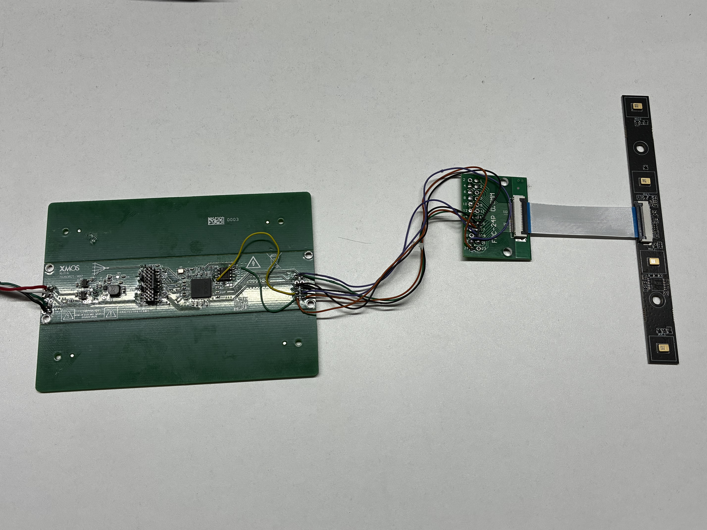
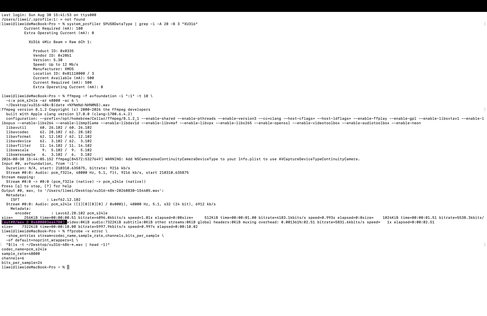
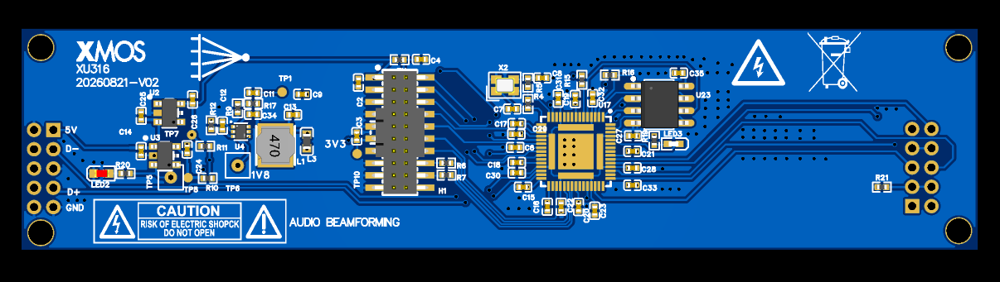

# SQ66 XU316 四麦波束成形音频板

基于 XMOS XU316 的四路 PDM 麦克风前端，面向 RK3588、PC 和其他 USB Host 提供板端音频处理。当前主版本同时输出两路波束结果与四路原始麦克风数据，便于直接使用、算法调试和后续升级。

<p align="center">
  
</p>

## 当前能力

- XMOS XU316 主控，四路 PDM 麦克风输入（DATA0～DATA3）。
- 48 kHz、16-bit、6 通道 USB 录音设备，Windows 与 macOS 已完成枚举和录音测试。
- USB 通道 1/2 为固定宽侧 delay-and-sum 波束结果，通道 3～6 为四路原始 PCM。
- W25Q16JW 1.8 V QSPI Flash 已通过烧录、回读和断电冷启动验证；正常运行不需要持续连接 XTAG4。
- 固件源码、预编译 `.xe`、录音工具、嘉立创 EDA Pro 硬件工程、PCB/3D 图、实物与测试证据统一归档。

## 系统数据流

```text
4 x PDM MEMS microphones
  DATA0 ─┐
  DATA1 ─┼─> XU316 PDM decimation ─┬─> fixed broadside delay-and-sum ─> USB CH1/CH2
  DATA2 ─┼─────────────────────────└─> raw PCM monitor ───────────────> USB CH3..CH6
  DATA3 ─┘

USB Type-C ─> PC / RK3588 (USB Audio capture)
W25Q16JW  ─> QSPI cold boot
XTAG4     ─> development, RAM run and Flash programming
```

## 六通道定义

| USB 通道 | 内容 | 用途 |
|---|---|---|
| 1 | 四麦宽侧波束结果 | 主处理音频 |
| 2 | 通道 1 的副本 | 双声道软件兼容 |
| 3 | DATA0 原始 PCM | 调试/二次算法 |
| 4 | DATA1 原始 PCM | 调试/二次算法 |
| 5 | DATA2 原始 PCM | 调试/二次算法 |
| 6 | DATA3 原始 PCM | 调试/二次算法 |

当前波束算法是固定零延时、等权求和的宽侧波束。它可体现四麦相干叠加，并保留原始通道用于离线分析；它尚不包含 AEC、DoA、自适应波束、VAD、AGC、降噪或去混响。

## 产品化能力现状

| 能力 | 当前状态 | 后续目标 |
|---|---|---|
| 系统架构 | 自研核心板 + 外接四麦线阵 | 优化阵列连接器、结构安装和 EMC 设计 |
| 麦克风采集 | 4 路 PDM，48 kHz | 增加麦克风增益、相位和一致性标定 |
| USB 音频 | 6 通道：2 路波束 + 4 路原始 | 完善 RK3588 ALSA 路由和长期稳定性测试 |
| 波束成形 | 固定宽侧 delay-and-sum | 可转向波束、自适应权重和阵列几何补偿 |
| 语音增强 | 尚未集成 | AEC、AGC、VAD、降噪、DoA 和去混响 |
| 固件启动 | XTAG4 调试；QSPI 冷启动已验证 | USB DFU、安全恢复和量产烧录流程 |
| 播放输出 | 当前版本未集成 | 根据产品需求增加 I2S、DAC 或扬声器功放 |
| 可开发性 | 硬件工程、应用源码和逐通道数据均归档 | 参数配置工具、自动测试和版本发布流程 |

本项目当前的核心价值是：在自研硬件上打通“四路 PDM → XU316 板端处理 → USB 六通道 → RK3588/PC”的完整链路，并同时暴露处理后与处理前数据。硬件与数据链路已经具备继续研发的基础，完整远场语音算法和产品化验证仍是后续工作。

## 已完成验证

- USB 标识：`XU316 4Mic Beam + Raw 6Ch 1`，VID/PID `20B1:0335`。
- 音频格式：48 kHz、16-bit、6 通道；四麦人声录音通过，无削波。
- Flash：W25Q16JW，JEDEC ID `EF 60 15`，QE 已开启。
- 以 10 MHz QSPI 烧录后连续三次回读前 64 KiB，均为 0 字节差异。
- 拔除 XTAG4、仅连接主板 Type-C，设备可以从 QSPI 冷启动并枚举。
- 左、右、前、后录音对比中，前向为最强；后向约比前向低 2.44 dB。该结果只能证明当前固定宽波束在运行，不能视为量产级指向性指标。

完整测试条件、结果和限制见 [`docs/TEST_REPORT.md`](docs/TEST_REPORT.md)。

<p align="center">
  
</p>

## 硬件资料

| 路径 | 内容 |
|---|---|
| `hardware/source/xu316-hardware-20260830.epro` | 嘉立创 EDA Pro 工程，内含 2 张原理图和 1 个 PCB |
| `hardware/renders/xu316-board-3d-render.png` | XU316 主板 3D 效果图 |
| `hardware/renders/xu316-board-pcb-layout.png` | XU316 主板 PCB 布局图 |
| `hardware/photos/xu316-board-bench-test.jpg` | XU316 主板实测图，展示通电和调试飞线状态 |
| `hardware/photos/xu316-four-microphone-system-test.jpg` | 四麦克风系统测试图，展示主板、转接板和线阵连接 |

更多说明见 [`hardware/README.md`](hardware/README.md)。

<p align="center">
  
</p>

## 固件版本

| 目录 | 输入 | USB 输出 | 状态 |
|---|---|---|---|
| `variants/single_mic_hardware_validation` | DATA0 | 2 通道 | 单麦硬件验证通过 |
| `variants/dual_mic_verified` | DATA0、DATA1 | 2 通道 | 双麦录音通过 |
| `variants/four_mic_raw` | DATA0～DATA3 | 4 路原始 PCM | 四麦原始采集通过 |
| `variants/four_mic_beamformer_broadside` | DATA0～DATA3 | 2 路相同波束 | 固定宽侧波束验证通过 |
| `variants/six_channel_beamformer_raw_monitor` | DATA0～DATA3 | 2 路波束 + 4 路原始 | 当前推荐版本；USB、录音和 QSPI 冷启动通过 |

推荐固件：`variants/six_channel_beamformer_raw_monitor/bin/app_six_channel_beam_raw_20260811.xe`

SHA-256：`0347F5A8B7EDE4942FD38320193A1D2F6BE11B8810A8450FCA33276DEF2E2B89`

## 运行与录音

开发阶段可使用 XTAG4 从 RAM 运行：

```powershell
cd C:\xmos_work\sq66_firmware_versions
.\variants\six_channel_beamformer_raw_monitor\run_xtag.cmd U8NUL5P2
```

保持该终端运行，在另一个 PowerShell 中录制六通道音频：

```powershell
cd C:\xmos_work\sq66_firmware_versions
python -m pip install -r .\requirements.txt
python .\variants\six_channel_beamformer_raw_monitor\host_tools\record_six_channel_beamformer.py `
  -t 30 -o C:\xmos_work\six_channel_voice_30s.wav
```

Flash 烧录完成并验证冷启动后，实际使用时只需连接主板 Type-C 到 RK3588 或 PC，不需要连接 XTAG4。烧录前必须确认 Flash 型号、1.8 V I/O、电源、BOOT_SEL 和 QSPI 引脚与本硬件版本一致。

## 仓库结构

```text
hardware/                  原理图/PCB 源工程、渲染图和实物照片
variants/                  单麦、双麦、四麦、波束与六通道固件快照
  <version>/source/        XMOS 应用源码
  <version>/bin/           已验证的 XE
  <version>/host_tools/    Windows 录音工具
  <version>/test_evidence/ 对应测试音频
shared/                    依赖补丁、修改文件和工程骨架
docs/                      依赖、恢复步骤、硬件测试与截图
SHA256SUMS.csv             仓库文件 SHA-256 清单
```

## 限制与路线图

- 对麦克风间距、增益和相位进行统一标定，建立可复现的消声/半消声方向图测试。
- 根据真实线阵几何加入可控延时与指向角，升级为可转向波束。
- 增加 AEC、噪声抑制、AGC、VAD、DoA 和去混响，并进行算力与延迟评估。
- 为 RK3588 补充稳定的 ALSA 设备绑定、通道路由和长期录音脚本。
- 增加 USB DFU 和安全恢复流程，减少量产阶段对 XTAG4 的依赖。

## 许可与说明

XMOS 及其他第三方代码继续受各自许可证约束。硬件照片、测试数据与本板应用代码仅用于本项目研发归档；在确认所有第三方授权前，不应将整个仓库直接视为可再许可的完整开源发行版。
